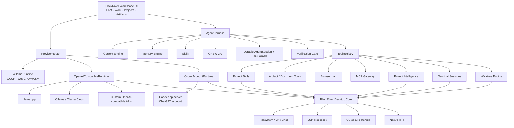

<p align="center">
  
</p>

<h1 align="center">BlackRiver Workspace</h1>

<p align="center">
  <strong>Seamless local-first AI workspace for Chat, agentic Work, Projects, Artifacts, local GGUF models and connected model runtimes.</strong>
</p>

<p align="center">
  Codex-class harness mechanics underneath. A quiet, polished BlackRiver interface on top.
</p>

<p align="center">
  
  
  
  
  
</p>

---

## What is BlackRiver Workspace?

BlackRiver Workspace is a **local-first AI desktop/web workspace** built around two simple modes:

- **Chat** when you want to think, ask, write, analyze or create without touching a project.
- **Work** when you want the model to inspect reality, use tools, modify a project, create artifacts, run verification and iterate until the result is usable.

The product deliberately avoids becoming an IDE cockpit or an agent-orchestration dashboard. Complex behavior such as tool repair, memory recall, policy decisions, multi-agent inspection, task recovery, verification, LSP lookup, worktrees and browser QA stays mostly **under the surface**.

> **BlackRiver principle:** more agent power underneath, almost no extra ceremony for the user.

BlackRiver can run a GGUF model directly in the renderer with Wllama, connect to local or remote model servers, use Ollama local/Cloud, or use a signed-in ChatGPT / Codex account in the Windows app. The same Chat and Work interface sits above every runtime.

---

## Highlights

| Area | What BlackRiver provides |
| --- | --- |
| **Local inference** | GGUF loading with Wllama 3.6, WebGPU when available, WASM/CPU fallback, sharded GGUF support, optional `mmproj` vision projector, Hugging Face GGUF browser and model history |
| **Model runtimes** | Wllama, llama.cpp, Ollama local, Ollama Cloud, custom OpenAI-compatible APIs, ChatGPT / Codex account runtime |
| **Agent Work** | Project-aware tool loop, self-healing tool calls, policy engine, durable sessions, task graph, verification, memory/context engines, CREW 2.0, hooks |
| **Coding tools** | Filesystem search/read/write/edit, Git status/diff, stack-aware verification, terminal sessions, LSP/project intelligence, isolated Git worktrees |
| **Artifacts** | HTML apps/games, code, text, Markdown, downloadable files, multi-file ZIPs, runtime inspection and same-artifact repair |
| **Browser Lab** | DOM inspection, console/runtime diagnostics, click, type, keyboard, scroll, timed waits and Desktop viewport screenshots for vision models |
| **Documents** | Real PDF, DOCX, XLSX and PPTX generation with editable BlackRiver source plus document ZIP bundles |
| **Projects** | Persistent project list, instructions, pinned context, file index, recent files, changed files, per-file diff/revert, session checkpoints and Undo |
| **Memory** | Global, Project, Conversation and Agent Experience scopes with progressive recall, automatic learning, pin/edit/forget/manual add |
| **Skills** | Built-in procedural skills plus imported `.md` / `SKILL.md` skills with `Auto / On / Off` behavior |
| **Plugins / MCP** | Streamable HTTP MCP servers, per-plugin `Allow / Ask / Deny`, compact tool discovery/call gateway, Desktop native transport |
| **Voice & writing** | Local Parakeet speech recognition, local Qwen3.5 2B prompt/writing refiner, Raw/Natural/Prompt voice modes and one-click text refinement |
| **UX** | `Ctrl/Cmd+K` command palette, smart context pills, drag & drop, quick model switcher, context meter, model-aware thinking effort, GREED, CREW toggle, responsive Artifact split |

---

## Contents

- [What is BlackRiver Workspace?](#what-is-blackriver-workspace)
- [Highlights](#highlights)
- [Why BlackRiver is different](#why-blackriver-is-different)
- [Chat and Work](#chat-and-work)
- [Model Runtime](#model-runtime)
- [BlackRiver Agent Harness](#blackriver-agent-harness)
- [Projects](#projects)
- [Artifacts](#artifacts)
- [Browser Lab](#browser-lab)
- [Documents and exports](#documents-and-exports)
- [Skills](#skills)
- [Plugins and MCP](#plugins-and-mcp)
- [BlackRiver Voice and local writing refinement](#blackriver-voice-and-local-writing-refinement)
- [Seamless UX](#seamless-ux)
- [Web vs Windows Desktop](#web-vs-windows-desktop)
- [Security and host boundaries](#security-and-host-boundaries)
- [Architecture](#architecture)
- [Getting started](#getting-started)
- [First-run setup](#first-run-setup)
- [Repository layout](#repository-layout)
- [Persistence and upgrades](#persistence-and-upgrades)
- [3.0.1 — Harness Reliability Hotfix](#301--harness-reliability-hotfix)
- [Current boundaries](#current-boundaries)
- [Pinned stack](#pinned-stack)
- [Upstream foundations](#upstream-foundations)

---

## Why BlackRiver is different

Most AI coding tools expose their machinery. BlackRiver tries to expose the **result**.

The user should not have to manage a task graph, inspect an orchestration DAG, configure a worktree for every attempt, administer a vector database, or understand why one provider expects `reasoning_effort` while another expects `think`.

BlackRiver owns those differences behind a stable surface:

```text
You ask
  ↓
BlackRiver understands the current Chat / Work / Project / Artifact context
  ↓
The harness selects the useful memory, skills, tools and runtime behavior
  ↓
The model acts
  ↓
BlackRiver verifies the result against the real project / artifact
  ↓
You see the answer, the artifact, or the changed files
```

When you need the details, they are still there: tool activity, Skills used, Crew roles, Changed Files, diffs, runtime diagnostics, context usage and verification evidence are all inspectable.

---

## Chat and Work

### Chat

Chat is the lightweight conversational surface. It supports:

- streaming responses;
- model reasoning/thinking display when provided by the runtime;
- image/audio/text attachments;
- drag-and-drop attachments;
- local Voice dictation;
- local writing refinement;
- Artifacts and downloadable deliverables when a task naturally produces one;
- conversation search;
- recents;
- long-conversation navigation;
- conversation export.

### Work

Work activates the BlackRiver agent harness.

Depending on the task and current project, Work can:

- inspect project structure;
- read one or many files;
- glob and grep;
- query symbols, definitions and references;
- create or edit project files;
- inspect Git status and diffs;
- run builds, tests and lint checks;
- start long-running terminal processes;
- create isolated Git worktrees;
- use connected MCP tools;
- recall or save durable memory;
- create and update Artifacts;
- run Browser Lab QA against HTML Artifacts;
- generate real documents;
- checkpoint edits and Undo them;
- recover an interrupted Work session.

Work is always scoped to the **conversation's stored project identity**, not whichever project happens to be visible later while a generation is still running.

---

## Model Runtime

### Local GGUF with Wllama

BlackRiver uses `@wllama/wllama@3.6.0` for direct browser/renderer inference.

You can load models from:

- one monolithic `.gguf` file;
- all shards of a sharded GGUF model;
- a local model folder;
- Hugging Face GGUF repositories from the built-in model browser.

Optional multimodal projectors (`mmproj`) can be selected alongside the model. When a compatible projector is present, local image input is exposed to the runtime.

The Advanced model panel exposes local Wllama controls for:

- context window;
- max output;
- temperature;
- GPU layers / automatic WebGPU offload;
- KV cache K type (`ctk`);
- KV cache V type (`ctv`).

The Models center is organized into **Recommended / Local / Hugging Face / Accounts / Advanced** surfaces.

The UI also exposes:

- current context use and remaining context;
- generation/prefill information when available;
- generation speed;
- local WebGPU status;
- local vision/projector status;
- model history and cached/reopenable Hugging Face entries.

#### Local-first model switching

The composer model chip is a searchable quick switcher. It can show:

- **Auto**;
- the currently loaded Wllama model;
- models discovered from connected API providers;
- signed-in ChatGPT / Codex account models.

`Auto` is intentionally conservative: **local-first when a local model is loaded**, otherwise it falls back to the current concrete provider. It does not silently start spending on an unrelated cloud provider.

---

### llama.cpp

llama.cpp is supported through its OpenAI-compatible HTTP server.

BlackRiver adds several compatibility layers specifically for local-model reliability:

- tool schemas are normalized to a llama.cpp-friendly JSON Schema subset;
- large native tool catalogs are compacted;
- grammar-risk paths can fall back to BlackRiver's prompt-native compatibility tool transport;
- tool execution and approval still remain inside BlackRiver's ToolRegistry;
- reasoning is **template-aware** instead of forcing one global parser family.

#### Reasoning / thinking

The UI intentionally exposes one simple intent control:

`Off ← Low ← Auto → Medium → High`

BlackRiver translates that intent by runtime/model:

- **llama.cpp** — native template `reasoning_effort` when the model/template exposes meaningful levels; otherwise per-request reasoning-budget fallback;
- **Wllama** — local template/model reasoning detection and its established budget surface;
- **Ollama** — boolean `think` for normal thinking-capable models; string effort levels only for GPT-OSS where Ollama actually supports them;
- **ChatGPT / Codex** — runtime/account policy remains owned by Codex.

The goal is to avoid pretending that every model family implements reasoning in the same way.

---

### Ollama

BlackRiver supports both local Ollama and Ollama Cloud.

The native Desktop path is preferred:

```text
BlackRiver Desktop
    ↓
http://127.0.0.1:11434/api/*
    ↓
local Ollama service / signed-in Ollama account
    ↓
local or cloud model
```

Model discovery uses Ollama's model list endpoint and inference uses Ollama chat streaming. The Windows app can launch the normal Ollama sign-in flow and then use the local Ollama service as the account boundary.

The pure browser build can also connect where browser CORS/network policy allows it. `vercel.json` includes the optional Ollama Cloud rewrite used by the web deployment path.

---

### ChatGPT / Codex account

BlackRiver Desktop can sign in with ChatGPT through the official Codex app-server account flow.

It does **not** scrape browser cookies and does **not** turn Codex OAuth credentials into a generic reusable API key.

After sign-in BlackRiver:

1. asks Codex for the model catalog;
2. exposes visible account models in the BlackRiver model selector;
3. creates/resumes Codex threads for BlackRiver conversations;
4. streams `thread/start` / `turn/start` output into the normal UI;
5. registers BlackRiver Work tools through Codex dynamic tools;
6. routes requested tools back through BlackRiver's ToolRegistry and approval/policy layer.

The model can therefore use BlackRiver project/artifact/MCP tools while BlackRiver keeps authority over the host environment.

---

### Custom OpenAI-compatible APIs

Any compatible endpoint can be added with:

- provider name;
- base URL;
- optional API key;
- discovered or manually supplied model IDs.

In Desktop, provider HTTP runs through native transport and saved secrets can use OS-backed secure storage. In the web build, browser CORS remains a real platform constraint.

> NVIDIA NIM is intentionally not an active provider in 3.0.1. Old NVIDIA provider records are retired during migration rather than kept as a half-supported integration.

---

## BlackRiver Agent Harness

### ToolRegistry

Every Work tool is exposed through one registry instead of being hardwired into individual runtimes.

The registry can contain:

- project tools;
- artifact/document tools;
- memory tools;
- Browser Lab tools;
- MCP/plugin tools;
- 3.0 harness services such as verification, terminal, worktree and Project Intelligence.

This separation lets Wllama, llama.cpp, Ollama and Codex use the same host capabilities even though their inference transports are different.

---

### Self-Healing Tool Layer

Local models often produce a function call that is almost correct: a misspelled tool name, familiar alias, wrong primitive type, near-match enum or slightly wrong parameter name.

BlackRiver repairs a tool call only when the correction is deterministic and schema-bounded.

Supported repairs include:

- near-match tool names;
- common aliases;
- near-match parameter names;
- safe primitive coercion;
- enum normalization;
- required/type validation before execution.

Ambiguous calls are **not guessed**. They go back to the model as real errors.

---

### Policy Engine

Host authority is resolved centrally through:

`allow / ask / deny`

The default policy is designed to remain quiet for normal inspection while protecting destructive or sensitive operations.

Typical behavior:

- project reads/search/inspection → **allow**;
- safe build/test/lint/status checks → **allow**;
- sandboxed Artifact QA → **allow**;
- project source writes → **ask**;
- terminal/worktree mutation → **ask** unless clearly safe verification;
- obvious secrets and destructive command patterns → **deny**;
- external navigation → **ask**.

Persisted custom policy rules can additionally match tool, path, command or host.

---

### Context Engine

BlackRiver does not repeatedly dump an entire repository into the prompt.

The Context Engine builds a compact project-aware context from:

- project instructions;
- pinned context;
- native/browser project identity;
- project file map;
- query-ranked relevant paths;
- recently touched files;
- changed files;
- recent conversation turns;
- compacted older history.

Common entry/config files receive useful priority. Lockfiles, minified output and map files are deprioritized. GREED further tightens context breadth.

---

### Memory Engine

Memory is progressive context, not a giant permanent prompt.

Supported scopes:

- **Global** — durable preferences across workspaces;
- **Project** — project-specific decisions and knowledge;
- **Conversation** — context intentionally scoped to one conversation;
- **Agent Experience** — reusable verified workflows and recovery knowledge.

Features include:

- relevance-ranked recall;
- automatic durable learning;
- manual memory creation;
- search;
- pin/unpin;
- edit;
- forget;
- deduplication/consolidation;
- obvious-secret rejection;
- per-scope enable/disable controls.

Recall is ranked by task relevance, scope, confidence and recency. Only a compact useful set is injected.

---

### Durable AgentSessions + Task Graph

Every Work run gets a persistent session record and a compact internal task graph.

A typical run starts as:

```text
Inspect context
  ↓
Implement
  ↓
Verify result
```

Real tool outcomes advance the graph and attach evidence. If BlackRiver closes or crashes while a run is active, the session becomes interrupted. On the next Work turn, BlackRiver injects a compact recovery block containing the actual persisted goal, project identity, recent tool outcomes and task state.

The graph is an execution primitive, **not a project-management UI**.

---

### Verification Gate

For native projects, `verify_project` detects useful project checks such as build, test and lint commands.

The verification loop can:

1. detect the project stack;
2. propose one verification plan;
3. obtain one approval for the plan when needed;
4. run the real commands;
5. feed failures back into the same Work loop;
6. repair and re-run verification.

This is also connected to Artifact verification: a green preview bootstrap is not treated as proof that an interactive behavior bug is fixed.

---

### CREW 2.0

CREW is an optional Work-only multi-agent inspection layer with `Off / Auto / On` control.

It does not flood the UI with multiple chat panes. Specialists run as small internal contexts and return evidence to the lead agent.

Possible specialists include:

- **Explorer** — maps a project and the smallest implementation surface;
- **Strategist** — lightweight execution strategy when no project is attached;
- **Quality** — inspects interactive/UI Artifact behavior and defines acceptance checks;
- **Verifier** — checks project evidence and can execute safe verification;
- **Critic** — challenges higher-risk architecture/security/performance/release decisions.

CREW 2.0 specialists can use role-scoped inspection tools. They do **not** receive normal primary-project source-writing tools by default. The lead remains the normal writer and checkpoint owner.

GREED intentionally reduces Crew fan-out.

---

### Project Intelligence — LSP + static fallback

The `code_intelligence` gateway exposes:

- symbol lookup;
- definition;
- references;
- outline;
- hover.

On Windows Desktop, BlackRiver can use language servers already installed on the machine:

| Language | Optional language server |
| --- | --- |
| JavaScript / TypeScript | `typescript-language-server` |
| Python | `pyright-langserver` |
| Rust | `rust-analyzer` |
| Go | `gopls` |

If a suitable server is missing or fails, BlackRiver automatically falls back to its built-in static project index.

No language server is mandatory to install BlackRiver.

---

### Persistent Terminal Sessions

For long-running processes Work can use a persistent project terminal:

- `start`;
- `read` incremental output;
- `write` stdin;
- `stop`;
- `list` sessions.

This is intended for dev servers, watchers, REPLs and long-running tests. Ordinary one-shot build/test/status checks continue to use `run_command`.

Terminal sessions are cleaned up when BlackRiver exits.

---

### BlackRiver Worktree Engine

Native Git projects can create isolated detached worktrees in BlackRiver's dedicated worktree area.

An agent can:

- create an isolated variant;
- read/edit files inside it;
- run commands;
- inspect status/diff;
- compare approaches;
- remove the worktree.

The primary project tree remains untouched until an approach is intentionally brought back. Worktrees are an advanced internal tool, not a permanent management panel.

---

### BlackRiver Hooks

The lifecycle hook engine emits events including:

- `BeforeTool` / `AfterTool` / `ToolFailed`;
- `BeforeEdit` / `AfterEdit`;
- `BeforeVerify` / `VerificationFailed`;
- `AgentSpawn`;
- `CheckpointCreated`;
- `TaskComplete`.

Hooks dispatch through the ToolRegistry, so they inherit the same host policy and approval boundaries.

---

### GREED

GREED is BlackRiver's persistent **useful-work-per-token** mode.

When enabled it favors:

- less narration;
- tighter history compaction;
- smaller context breadth;
- less repeated context;
- fewer unnecessary tool schemas;
- reduced Crew fan-out.

GREED is not supposed to skip required implementation or verification. It changes economy, not the definition of done.

---

## Projects

BlackRiver Projects are persistent, isolated Work contexts.

A project can be backed by:

- a browser File System Access directory handle; or
- a native Desktop path.

Per project BlackRiver remembers:

- project name and identity;
- project instructions;
- pinned context;
- indexed project files;
- recently touched files;
- Changed Files;
- Work checkpoints;
- project-linked conversations;
- project-linked Artifacts.

### Changed Files and Undo

Project writes/edits record the original content before mutation.

The Projects surface provides:

- changed-file status (`A / M / D`);
- per-file diff;
- per-file revert;
- latest Work checkpoint;
- **Undo last Work session**.

After a checkpointed Work response, the conversation can also show compact contextual actions such as:

`N changed` · `Undo`

The full Changed Files view remains the source of truth.

### Path confinement

Native project operations live in `desktop/project-core.mjs`. Renderer code does not receive unrestricted Node filesystem access. Tool paths are resolved relative to the selected project root before reaching host operations.

---

## Artifacts

Artifacts are first-class outputs rather than large code dumps in chat.

Viewer Artifact types:

- HTML;
- code;
- text;
- Markdown.

Downloadable outputs:

- individual text/code/data files;
- multi-file ZIP bundles;
- generated PDF/DOCX/XLSX/PPTX documents;
- document bundles.

The Artifact panel includes:

- live Preview;
- Code view;
- multiple-artifact picker;
- download;
- fullscreen/expanded view;
- resizable split layout;
- runtime issue surface.

### Artifact Intelligence

When Work creates or updates HTML, BlackRiver executes it in a sandbox and collects:

- preview bootstrap state;
- `window.onerror`;
- unhandled promise rejections;
- `console.error` diagnostics.

A failed interactive Artifact can be fed back into the same Work loop for repair.

### Sandboxing

Generated HTML runs in an iframe with a deliberately opaque origin. The iframe is not granted `allow-same-origin`.

The bridge provides only the runtime functions required by BlackRiver Preview and Browser Lab.

---

## Browser Lab

Browser Lab turns the existing Artifact preview into an agent-controlled QA surface without changing the saved source-of-truth model.

Available operations include:

- `browser_get_state`;
- `browser_inspect`;
- `browser_click`;
- `browser_type`;
- `browser_key`;
- `browser_scroll`;
- `browser_wait`;
- `browser_console`;
- `browser_snapshot`.

### Source of truth

In 3.0.1, **ArtifactStore is always authoritative**.

Browser Lab can read and interact with a saved HTML Artifact, but it is never allowed to become a fallback source editor. Work is explicitly prevented from replacing a missing Artifact tool with browser-side `document.write`, `innerHTML`, `setContent` or equivalent DevTools injection.

Every Browser Lab command is bound to:

- the active conversation;
- the selected Artifact ID;
- the exact saved Artifact revision.

A `click → wait → inspect` sequence stays on the same live iframe instead of silently reloading the application between commands.

### Behavioral QA

BlackRiver distinguishes:

1. **preview ready**;
2. **runtime healthy**;
3. **behavior verified**.

For timing, animation, loading, race, game-loop or delayed-interaction regressions, Browser Lab can require an actual `browser_wait` on the latest revision before the harness treats the behavior as verified.

### Vision

On BlackRiver Desktop, `browser_snapshot` captures the actual visible Artifact viewport. Vision-capable models receive the image as multimodal context and can continue the same Work loop using what was really rendered.

The web build retains DOM/interaction QA but does not provide the native viewport capture.

---

## Documents and exports

### Document Studio

BlackRiver can generate real:

- **PDF**;
- **DOCX**;
- **XLSX**;
- **PPTX**.

Generated documents retain editable BlackRiver source, so a later Work turn can read the current source, update it and regenerate the downloadable file.

Input conventions:

- PDF/DOCX/PPTX use Markdown-like source;
- PPTX separates slides with `---`;
- XLSX accepts CSV, TSV or Markdown-table source.

Multiple generated documents can be packaged into one ZIP bundle.

> Current boundary: BlackRiver updates documents it generated from its retained source. Arbitrary imported Office/PDF round-trip editing is not a 3.0.1 feature.

### Conversation export

Any populated conversation can be exported as:

- Markdown;
- HTML;
- JSON;
- PDF;
- DOCX;
- Complete ZIP containing MD + JSON + HTML + PDF + DOCX.

---

## Skills

Skills are reusable procedural instruction modules selected progressively rather than injected into every prompt.

Each skill can be:

- **Auto** — BlackRiver resolves it from the task;
- **On** — always active;
- **Off** — disabled.

Up to three relevant Auto skills are normally selected for one turn.

Built-in skills in 3.0.1:

| Skill | Category | Purpose |
| --- | --- | --- |
| **Code Surgeon** | Engineering | Targeted code changes with minimal regression surface |
| **Interface Finisher** | Design | Product-level UI polish and interaction quality |
| **Artifact Forge** | Creation | Complete self-contained artifacts and deliverables |
| **Indie Game Director** | Creative | Higher-quality interactive game direction and QA |
| **Repo Cartographer** | Engineering | Repository exploration and implementation mapping |
| **Verification Gate** | Quality | Evidence-driven testing and verification |
| **Performance Hunter** | Engineering | Runtime/performance investigation and optimization |
| **API Architect** | Integration | Provider/API/auth/streaming/MCP integrations |
| **Prompt Foundry** | Intelligence | Precise prompts and system instructions |
| **Release Commander** | Delivery | Safe packaging, versioning and release verification |

Custom skills can be imported from `.md` / `SKILL.md` files. BlackRiver understands common frontmatter such as name/description/triggers and stores the imported skill in the same resolver.

The assistant turn can display the exact Skills selected by Auto mode.

---

## Plugins and MCP

BlackRiver includes a real MCP/plugin surface above the ToolRegistry.

Each Streamable HTTP MCP server has:

- name;
- URL;
- connection status;
- discovered tool count;
- approval policy: `Allow / Ask / Deny`.

The current client attempts:

1. **MCP 2026-07-28** stateless flow;
2. **MCP 2025-11-25** initialize/session flow as a compatibility fallback.

To keep local-model tool grammars small, BlackRiver does not have to dump every connected MCP schema into every request. Models can use the compact gateway:

- `list_mcp_tools` — ranked discovery by task/domain;
- `call_mcp_tool` — execute one exact discovered tool.

In Desktop, MCP HTTP can use BlackRiver's native networking path, avoiding normal browser CORS limitations. In the pure web build the MCP server must allow browser access.

---

## BlackRiver Voice and local writing refinement

BlackRiver Voice is an optional local speech-to-prompt sidecar integrated directly into the composer.

Current 3.0.1 pipeline:

```text
Microphone
  ↓
AudioWorklet PCM capture
  ↓
16 kHz mono audio
  ↓
Parakeet TDT 0.6B v3 SmoothQuant ONNX
  ↓
raw transcript
  ├─ Raw      → composer
  ├─ Natural  → local Qwen3.5 2B refiner → composer
  └─ Prompt   → local Qwen3.5 2B prompt architect → composer
```

Voice modes:

- **Raw** — transcription only;
- **Natural** — cleans dictation while preserving intent;
- **Prompt** — turns speech into a more precise execution-ready instruction.

Natural/Prompt can additionally control:

- writing style;
- output structure;
- destination context.

The Qwen sidecar is intentionally separate from the main inference runtime. Voice/refinement models are lazy-loaded, cached locally by the browser, and released around main-model generation to reduce unnecessary GPU residency.

### Refine writing

The composer can also refine typed text locally without using the active chat model.

Presets include:

- Prompt;
- Natural;
- Friendly;
- BlackRiver;
- Professional;
- Concise.

---

## Seamless UX

BlackRiver's 3.x harness features are deliberately hidden behind small contextual controls instead of permanent dashboards. The primary navigation keeps the product surface simple: **New chat, Search, Library, Projects, Skills, Memory, Models and Plugins**, with recent conversations underneath.

### BlackRiver Command

`Ctrl+K` / `Cmd+K` opens the compact BlackRiver Command palette for common workspace actions.

### Smart Context

In Work, context-ranked file pills appear only when useful for the current task. Clicking a pill references that path directly.

### Drag and drop

The composer accepts:

- images;
- audio;
- text;
- Markdown;
- JSON;
- source code;
- logs;
- shell scripts;
- common config/data formats.

Supported text attachments are injected as task context without replacing the user's visible message.

### Quick model switcher

Clicking the model chip opens a searchable model menu instead of forcing the user into Settings.

### Context meter

The composer exposes local model context usage, available context and useful runtime diagnostics without turning the primary interface into a profiler.

### Thinking effort

One compact slider exposes model-aware reasoning intent instead of provider-specific API jargon.

### GREED and CREW

Both remain one-click controls in Work rather than large configuration surfaces.

### Artifact split

The Artifact panel can open beside the conversation, resize, expand to fullscreen, switch Preview/Code, and preserve a usable composer in the remaining chat lane.

---

## Web vs Windows Desktop

The same renderer is used for both, but Desktop owns the capabilities that require native host authority.

| Capability | Web build | Windows Desktop |
| --- | :---: | :---: |
| Wllama local GGUF inference | ✅ | ✅ |
| WebGPU / WASM local runtime | ✅ | ✅ |
| Hugging Face GGUF search/download | ✅ | ✅ |
| Local File System Access project | ✅* | ✅ |
| Native project path | — | ✅ |
| Shell / Git / verification | — | ✅ |
| Persistent terminal sessions | — | ✅ |
| Git worktrees | — | ✅ |
| External LSP processes | — | ✅ |
| Custom API providers | ✅* | ✅ |
| Ollama local / Cloud | ✅* | ✅ |
| ChatGPT / Codex account sign-in | — | ✅ |
| OS-encrypted saved credentials | — | ✅ |
| MCP Streamable HTTP | ✅* | ✅ |
| Artifact DOM/interaction Browser Lab | ✅ | ✅ |
| Native Artifact viewport screenshot for vision | — | ✅ |
| PDF/DOCX/XLSX/PPTX generation | ✅ | ✅ |
| Voice / local writing refiner | ✅** | ✅** |

`*` Browser permissions/CORS/network policy apply.  
`**` Requires the browser features used by the local audio/WebGPU pipeline.

For the complete Work harness, **BlackRiver Desktop is the recommended runtime**.

---

## Security and host boundaries

BlackRiver's agent can be powerful without giving generated content or models unrestricted host access.

### Desktop renderer isolation

The renderer does not receive raw Node filesystem power. Native capabilities live in the Electron main process and are exposed through narrow preload/native bridges.

### Stable renderer origin

Packaged Desktop is served from:

```text
http://127.0.0.1:47819
```

BlackRiver uses a single-instance lock and refuses to silently switch to a random port. This is intentional: Chromium storage is origin-scoped, so changing the port would make conversations, Projects, Artifacts and settings appear to disappear.

### Credential storage

Desktop secrets use Electron `safeStorage` where available.

The renderer stores opaque credential IDs rather than the raw native secret, and credentials can be bound to approved origins so a saved key is not silently attached to a different host.

### Artifact isolation

Generated HTML runs in an opaque-origin sandbox without `allow-same-origin`.

### Project confinement

Project tools receive project-relative paths. Native path resolution remains confined to the active project root.

### Policy + approvals

Policy decisions happen before host execution and still preserve explicit approval for sensitive actions.

---

## Architecture



The important architectural boundary is that **inference does not own the host**. BlackRiver does.

---

## Work execution model

A normal project-editing Work turn looks approximately like this:

```text
User request
   ↓
Conversation + project identity locked for this run
   ↓
Context Engine + Memory + Skills
   ↓
Optional CREW evidence preflight
   ↓
Lead model
   ↓
Tool call
   ↓
Self-healing validation
   ↓
Policy Engine / approval
   ↓
ToolRegistry
   ↓
Project / Artifact / Browser / MCP / native operation
   ↓
Observation returned to model
   ↓
Checkpoint + task evidence updated
   ↓
Verification Gate
   ↓
Final answer + Changed Files / Artifact / document
```

For HTML work, the loop can continue into:

```text
update_artifact
   ↓
latest saved revision renders
   ↓
Browser Lab binds to that exact revision
   ↓
inspect / click / type / key / wait / console / snapshot
   ↓
repair same Artifact if required
```

---

## Getting started

### Requirements

For development/building:

- a current **Node.js LTS** release;
- npm;
- a modern Chromium-based browser for the web build;
- Windows for the packaged Electron desktop target.

Optional external software depends on the features you want:

- Ollama for local/Ollama account models;
- llama.cpp `llama-server` for an OpenAI-compatible local server;
- Git for native Git features/worktrees;
- optional language servers for full LSP-backed Project Intelligence.

---

### Install dependencies

From the repository root:

```bash
npm install
```

Pinned major application dependencies are recorded in `package.json`.

---

### Run the web development build

```bash
npm run dev
```

or on Windows:

```bat
START_DEV.bat
```

The Vite development server binds to `127.0.0.1` and configures the cross-origin isolation headers required by the local browser inference path.

---

### Build the web app

```bash
npm run build
```

or:

```bat
BUILD.bat
```

Output:

```text
dist/
```

Preview the production build with:

```bash
npm run preview
```

---

### Run BlackRiver Desktop from source

```bash
npm run desktop
```

This builds the Vite renderer and launches Electron.

---

### Build the Windows installer

The simplest path is:

```bat
BUILD_DESKTOP.bat
```

Equivalent npm command:

```bash
npm run desktop:dist
```

Installer output is written to:

```text
release/
```

A portable target is also available through:

```bash
npm run desktop:portable
```

---

## First-run setup

### Load a local GGUF

Open **Models → Local** and either:

1. select one GGUF or all shards plus an optional `mmproj`; or
2. open a model folder and let BlackRiver scan it.

You can also use **Models → Hugging Face** to search GGUF repositories and download/load a selected model/projector.

### Connect llama.cpp

Add an API provider pointing at the llama.cpp server root, for example:

```text
http://127.0.0.1:8080
```

BlackRiver stores the root and handles the OpenAI-compatible `/v1` calls internally.

### Connect Ollama

For local Ollama, the normal endpoint is:

```text
http://127.0.0.1:11434
```

In Desktop, the account panel can also use the installed Ollama application's sign-in path.

### Sign in with ChatGPT / Codex

In Desktop:

**Models → Accounts → ChatGPT / Codex → Sign in with ChatGPT**

Complete the normal browser login, return to BlackRiver, then select one of the models returned by Codex.

### Add an MCP server

Open **Plugins** and provide a Streamable HTTP endpoint, for example:

```text
http://127.0.0.1:3000/mcp
```

Then choose its approval policy and connect it.

---

## Repository layout

```text
BlackRiver Workspace
├─ src/
│  ├─ accounts/       # Desktop account state and secure credential coordination
│  ├─ artifacts/      # ArtifactStore, document generation, ZIP packaging
│  ├─ harness/        # AgentHarness, Crew, Context, Policy, Hooks, Task Graph, Browser Lab
│  ├─ memory/         # progressive durable memory engine
│  ├─ models/         # model history + Hugging Face GGUF discovery
│  ├─ native/         # renderer-facing native bridge
│  ├─ plugins/        # MCP/plugin store and compact gateway
│  ├─ projects/       # persistent project metadata/checkpoints
│  ├─ providers/      # provider router and runtime adapters
│  ├─ runtime/        # Wllama local runtime
│  ├─ skills/         # built-in/imported Skills resolver
│  ├─ tools/          # central ToolRegistry
│  ├─ voice/          # Parakeet + Qwen voice/refinement sidecars
│  ├─ main.js         # Workspace renderer/application surface
│  └─ styles.css      # BlackRiver UI
│
├─ desktop/
│  ├─ main.mjs                # Electron host + stable renderer origin
│  ├─ preload.cjs             # narrow renderer/native bridge
│  ├─ project-core.mjs        # native filesystem / shell / Git / terminal / worktrees
│  ├─ lsp-service.mjs         # external language-server bridge
│  ├─ secure-store.mjs        # Electron safeStorage credentials
│  ├─ codex-app-server.mjs    # ChatGPT/Codex app-server integration
│  └─ document-studio.mjs     # native document generation path
│
├─ docs/               # release notes, regression plans, architecture/upstream notes
├─ public/             # BlackRiver marks/assets
├─ build/              # Windows app icons/build resources
├─ api/                # optional web relay helpers
├─ package.json
├─ vite.config.js
├─ BUILD.bat
├─ BUILD_DESKTOP.bat
└─ START_DEV.bat
```

---

## Persistence and upgrades

3.0.1 deliberately preserves the established storage identities from the accepted 2.4 baseline.

Important stable identities:

```text
Electron appId:  ai.blackriver.workspace
Desktop origin:  http://127.0.0.1:47819
```

Existing conversations, Projects, providers, Artifacts, Memory, Skills and settings remain in their established stores. 3.x adds new namespaces such as the Policy and Hook engines rather than migrating everything into replacement databases.

Desktop also maintains a native backup/restore path for BlackRiver renderer `localStorage` product state. Artifact-preview app storage is intentionally excluded from that backup so generated apps cannot bloat the durable Workspace configuration snapshot.

This is important when installing a new BlackRiver build over an existing installation: **do not delete the normal application-data directory unless you intentionally want to reset Workspace state.**

### Artifact storage note

Viewer/download Artifact metadata is persisted in browser storage. Extremely large generated bundles can exceed the browser's localStorage quota; in that case BlackRiver keeps the artifact usable for the current session and surfaces a persistence warning instead of failing the generation.

---

## 3.0.1 — Harness Reliability Hotfix

3.0.1 preserves the 3.0 product/UI surface while hardening real Work loops observed during Artifact debugging.

### Artifact ↔ Browser source of truth

- Browser Lab is read/interact/QA-only.
- Source changes stay in `create_artifact` / `update_artifact`.
- Browser injection is not an editor fallback.
- Browser tools are restricted to the current conversation and exact saved revision.

### Browser state continuity

Browser Lab no longer reloads an already-current Artifact between commands. Interactive state survives sequences such as:

```text
browser_click → browser_wait → browser_inspect
```

### Timing-aware verification

Behavioral bugs are not considered fixed merely because the console is clean. Timing/game-loop/loading problems require evidence from the latest saved revision and can require an actual wait.

### Quieter Work

Pre-tool implementation rehearsal is buffered in Work. The user sees compact activity instead of long scratch narration before the model acts.

### Template-aware reasoning

The Thinking selector is now translated by actual runtime/model semantics instead of forcing one universal field.

### Keyboard QA

Browser Lab maps letter/digit keys to real browser `KeyboardEvent.code` values such as `KeyP` and `Digit1`, with explicit code override when necessary.

See [`docs/RELEASE_301.md`](./docs/RELEASE_301.md) and [`docs/TEST_301.md`](./docs/TEST_301.md).

---

## Testing and release documentation

The repository intentionally keeps detailed regression plans beside release notes.

Useful starting points:

- [`docs/RELEASE_301.md`](./docs/RELEASE_301.md) — current 3.0.1 changes;
- [`docs/TEST_301.md`](./docs/TEST_301.md) — current hotfix regression plan;
- [`docs/RELEASE_300.md`](./docs/RELEASE_300.md) — 3.0 harness release;
- [`docs/TEST_300.md`](./docs/TEST_300.md) — 3.0 regression plan;
- [`docs/RELEASE_240.md`](./docs/RELEASE_240.md) — Memory/Context/Durable Sessions/Verification/CREW baseline;
- [`docs/ARCHITECTURE.md`](./docs/ARCHITECTURE.md) — architecture notes;
- [`docs/PROVIDERS.md`](./docs/PROVIDERS.md) — provider architecture;
- [`docs/UPSTREAM.md`](./docs/UPSTREAM.md) — upstream basis;
- [`docs/VOICE_140.md`](./docs/VOICE_140.md) — Voice 1.4 pipeline notes.

---

## Current boundaries

BlackRiver is intentionally opinionated about several boundaries:

- **Desktop is the full harness.** Browser-only mode cannot provide native shell/Git/LSP/worktree/Codex-account authority.
- **Browser CORS is not hidden with random public proxies.** Use Desktop native transport where appropriate.
- **Browser Lab is not an Artifact editor.** The saved Artifact remains authoritative.
- **CREW specialists do not normally write the primary project tree.** The lead retains normal mutation ownership.
- **LSP is optional.** Static Project Intelligence remains available without external language servers.
- **Worktrees require a native Git project.**
- **Terminal sessions are for long-running processes; source mutations should still use checkpoint-aware edit tools.**
- **Generated documents are editable from retained BlackRiver source; arbitrary imported Office/PDF round-trip editing is not included.**
- **NVIDIA NIM remains retired in this release.**

These are deliberate reliability choices, not missing UI toggles.

---

## Pinned stack

BlackRiver Workspace 3.0.1 currently pins:

| Component | Version |
| --- | ---: |
| Electron | `43.4.0` |
| electron-builder | `26.15.3` |
| Vite | `8.2.2` |
| `@openai/codex` | `0.149.0` |
| `@wllama/wllama` | `3.6.0` |
| `onnx-asr-web` | `0.1.3` |
| `onnxruntime-web` | `1.27.0` |
| `docx` | `9.7.1` |
| `exceljs` | `4.4.0` |
| `pptxgenjs` | `4.0.1` |

See [`package.json`](./package.json) for the authoritative dependency list.

---

## Upstream foundations

BlackRiver builds on strong open tooling while keeping its own runtime/harness boundary:

- **Wllama** — browser worker GGUF inference, WebGPU support, chat templates, tool calls and multimodal model support;
- **llama.cpp** — supported as an external OpenAI-compatible local inference server and an architectural/UX reference;
- **OpenAI Codex package/app-server** — official ChatGPT/Codex account integration path;
- **ONNX Runtime Web / onnx-asr-web** — local Voice ASR runtime;
- **Parakeet TDT** — current Voice transcription model family;
- **Qwen3.5 2B sidecar** — local Voice/writing refinement.

See [`docs/UPSTREAM.md`](./docs/UPSTREAM.md) for the repository's upstream notes.

---

## BlackRiver philosophy

BlackRiver Workspace is not trying to win by exposing the most controls.

It is trying to make powerful local and connected models feel like they belong inside one coherent product:

- **local when local is enough;**
- **connected when a stronger runtime is useful;**
- **agentic when action is required;**
- **quiet when the machinery is not the user's problem;**
- **verifiable when the model claims something is finished.**

**Seamless for the user. Serious underneath.**
